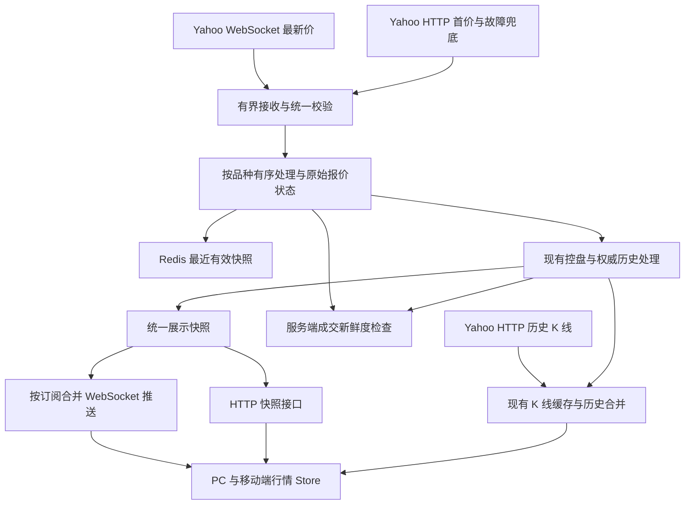

# 价格接收与推送优化方案

日期：2026-09-22。状态：代码已实现，已部署 shadow 旁路观测版；完整交易时段验收和主源切换尚未完成。实施与验收见 [发布记录](market-price-streaming-rollout.md)。下文“当前实现”记录改造前基线。依据：工作区代码、yfinance 文档及源码、Yahoo WebSocket 连接测试。

## 1. 目标与实施范围

采用“Yahoo WebSocket 接收最新价、HTTP 补首价和故障兜底、统一报价状态、后端合并推送、前端按需订阅”的方案。历史 K 线继续使用 HTTP。

第一阶段只改 Yahoo 对应的 Forex、US、CFD、Oil 行情接入；Bitget 和 Alltick 保持现有接入。推送、前端订阅和报价状态的公共优化适用于各来源。沿用 Java 8 / Spring Boot 和现有 Redis、MySQL；yfinance 用作协议参考与验证工具，不新增 Python 常驻服务。

目标是减少轮询等待、重复请求和重复计算，同时保证展示价、源报价与成交资格含义一致。更快的传输不能让延迟源数据变成实时数据，也不能补回上游未发送的逐笔成交。

## 2. 当前实现及具体问题

| 环节 | 当前代码行为 | 优化重点 |
|---|---|---|
| Yahoo 最新价 | 按分类调用 `/v8/finance/spark`，正常约每 3 秒一次 | 对验证通过的品种启用 WebSocket；按品种 HTTP 兜底 |
| Yahoo 历史 K 线 | HTTP `/v8/finance/chart`；最新查询缓存约 15 秒，历史分页约 5 分钟 | 保留队列与缓存，减少前端重复查询，避免拖慢报价处理 |
| 调度 | 每分类一个执行通道，报价 HTTP 和 K 线 HTTP 在该通道执行 | 接收回调、报价处理和慢 HTTP 请求隔离 |
| 原始报价 | 内存保存快照，写 Redis，调用控盘历史处理 | 建立两种传输共用的校验、排序、发布入口 |
| 新鲜度 | `QuoteState` 同时检查源时间、获取时间，默认 15 秒 | 区分连接健康、数据新鲜与交易可用；保留成交约束 |
| 下游 WebSocket | 每秒向每个客户端发送全部已订阅报价 | 先共享一次计算，再按变化合并发送 |
| 下游计算 | 每个客户端逐个调用 `internalPrice()`，其中包含控盘处理和数据库访问路径 | 同一推送周期，同一品种只计算一次，不按用户数重复执行 |
| 移动端首页 | 已有 WebSocket，同时每 3 秒 HTTP 查价格和首页 5 分钟 K 线 | 健康连接下停止价格轮询；首页小图按可见品种低频校准 |
| PC 页面 | 当前路由入口为 `DesktopTrade.vue`；仓库中的 `Home.vue` 不是当前入口 | 修改实际调用链，不能将遗留首页轮询算作 PC 当前负载 |
| 图表 | 普通行情约 14–15 秒校准；控盘历史约 1 秒校准 | 普通行情与权威控盘历史分别处理，不能统一降低频率 |
| 前端连接 | 已有重连、重新订阅、30 秒 ping、10 秒 pong 超时；最多重试 10 次 | 增加长时间离线恢复、共享连接 Promise 和集中兜底 |
| 源历史 | `market_source_tick` 主键为 `(symbol_id, source_time)` | 审核同时间不同价格的保存方式，防止流式数据被覆盖或忽略 |

已有的请求超时、HTTP 429 退避、按分类隔离、源时间校验、慢客户端发送限制应继续复用。前端价格 HTTP 接口读取服务端快照，并非每个浏览器都直接请求 Yahoo；减少前端轮询主要降低本站负载。

## 3. 目标数据流



这里存在两层 WebSocket：Yahoo 到后端，以及后端到浏览器。两层连接独立监测；浏览器始终使用本项目后端的统一报价。

第一版按单个行情采集实例设计。若实际部署多个后端副本，必须先确定唯一采集与报价版本的归属，再通过现有 Redis 分发；不能让每个副本各自生成互不一致的版本和控盘事件。当前不预先引入 Kafka 或独立行情微服务。

## 4. Yahoo 上游接入

### 4.1 协议和品种映射

连接地址：

```text
wss://streamer.finance.yahoo.com/?version=2
```

订阅与取消订阅：

```json
{"subscribe":["AAPL","EURUSD=X","USDJPY=X","CL=F","^GSPC"]}
```

```json
{"unsubscribe":["AAPL"]}
```

消息先解析 JSON，再对 `message` 做 Base64 解码和 Protobuf 解析。使用 `PricingData` 对应的字段定义及兼容 Java 8 的 Protobuf 实现，不手写二进制协议。库版本和生成工具版本在实施时核验并锁定。yfinance 的异步实现每 15 秒重发订阅，可作为初始保活参考；这不等于 Yahoo 对所有客户端的公开强制规范。[协议实现](https://raw.githubusercontent.com/ranaroussi/yfinance/main/yfinance/live.py)、[字段定义](https://raw.githubusercontent.com/ranaroussi/yfinance/main/yfinance/pricing.proto)

复用并集中管理当前 `mapSymbolToYahoo()` 映射。建立 Yahoo 代码到内部品种的反向索引，支持一个外部代码对应多个内部产品；缓存键必须区分类别。不能因多个内部产品共享源价而共享它们的控盘状态。

品种代码能用于 HTTP 查询，不代表一定有 WebSocket 推送。尤其要核对：CFD 当前映射的是指数、原油映射的是期货；二者并不是内部产品独立的可成交报价。

### 4.2 连接与订阅管理

- 初始一个共享 Yahoo 连接，订阅去重后的代码；只有实测容量或隔离需求证明必要时才分连接，不假定官方连接或订阅上限。
- 订阅集合来自服务端品种配置。可交易品种、持仓/挂单、运行中控盘需要的源报价应持续采集，不依赖是否有人打开页面。
- 品种配置变化做增量订阅；每次重连后恢复完整订阅，移除旧连接回调，防止双连接同时写入。
- WebSocket 接收回调只做长度检查、解析和投递。数据库、Redis、HTTP 和客户端发送不放在回调中。
- 设置连接超时、消息大小上限、有界处理队列。重连采用约 1、2、4、8、16、30 秒退避并加随机抖动；稳定运行一段时间后重置退避。
- 分别记录最后网络活动、最后有效消息、每品种最后源时间。无报价不直接等同断线：先检查连接存活，再按品种判断数据状态。
- 休市、低流动性和推送不覆盖都可能导致静默；不得因每个静默品种分别重启整条连接。握手成功和订阅发送成功不等于该品种已有有效报价。

### 4.3 HTTP 兜底与切回

| 场景 | 处理 |
|---|---|
| 启动或首次订阅 | 立即提供缓存状态，批量获取一次 HTTP 首价，同时建立订阅 |
| WebSocket 健康且该品种数据有效 | 关闭该品种常规 HTTP 价格轮询 |
| 已知不覆盖的品种 | 保留现有 HTTP 批量轮询 |
| 连接断开或该品种临近过期 | 对需要兜底的品种合并发起 HTTP 请求，避免等整类失效 |
| HTTP 429 | 遵循 `Retry-After`，复用指数退避；K 线和兜底共享 Yahoo 主机请求预算 |
| HTTP 返回缺失或旧数据 | 保留最后有效价用于展示，更新错误/过期状态，不延长成交有效期 |
| WebSocket 恢复 | 按品种收到有效且时间不倒退的数据后切回，短暂稳定观察后关闭该品种兜底 |
| 两种传输均失败 | 保留旧价并明确不可交易，恢复后自动重新评估 |

短时观察与过期阈值的起始建议见第 9 节。失败影响的是对应传输通道；HTTP 请求失败不能将仍有有效 WebSocket 报价的同类品种一起标为不可用。

HTTP 兜底与 WebSocket 使用同一 Yahoo 数据源，只增加传输方式的冗余，不解决 Yahoo 整体断源。若验收发现某类数据持续延迟或缺失，该品种保留现状或另行评估数据源，不能通过放宽时间检查宣称优化成功。

## 5. 统一报价、时间和排序

### 5.1 字段含义

在兼容现有字段的前提下，补充明确的来源和版本信息：

| 字段 | 含义 |
|---|---|
| `source` / `transport` | Yahoo 等来源，以及 `ws` / `http` 传输方式 |
| `sourceTimestamp` | 上游报价发生时间，统一为 epoch 毫秒 |
| `fetchedAt` | 本机收到该报价的时间，保留现有字段兼容性 |
| `timestamp` | 现有展示事件时间；控盘/模拟场景可能与源时间不同 |
| `expiresAt` | 服务端按源时间和接收时间计算的截止时间 |
| `status` / `available` | 保持现有状态含义，供旧前端继续使用 |
| `displayAvailable` / `tradeAvailable` | 明确可显示旧价与允许成交是两件事，复用现有同义字段 |
| `marketState` | 若能可靠判断，标识开市、盘前盘后、休市；否则为未知 |
| `epoch` / `quoteVersion` | 服务实例代次，以及该品种快照的递增版本 |
| `marketRevision` 等 | 保留现有品种配置、模拟会话、控盘任务状态字段 |

`quoteVersion` 用于防止本站 HTTP 和 WebSocket 返回顺序不同造成旧值覆盖；它不是交易所序号。服务端重启后 `epoch` 改变，客户端取消旧请求并获取完整快照，再接受新代次。服务端的快照值和版本必须原子发布，HTTP 和 WebSocket 读取同一份快照。

源数据校验至少包含：已配置代码、有限且大于零的价格、有效源时间、秒/毫秒归一化、异常未来时间和消息类型。价格为零不能拿来表示字段缺失。

Protobuf 中 `price` 为 float，转换成 BigDecimal 不会增加原始精度。显示按品种精度处理，交易计算沿用现有精度规则。可选的昨收、买卖价、成交量等字段缺失时保留未知，不能用 Protobuf 默认零覆盖已有有效值。[PricingData 定义](https://raw.githubusercontent.com/ranaroussi/yfinance/main/yfinance/pricing.proto)

### 5.2 更新接受规则

1. HTTP 和 WebSocket 都进入一个共享的报价接受方法，串行处理同一品种；慢 HTTP 请求在该方法之外执行。
2. 比当前源时间更旧的报价不能覆盖最新报价。完全重复的事件不重复落历史；价格不变但源时间更新，仍需更新新鲜度。
3. 同源时间、不同价格必须显式处理。对同一连接按接收顺序编号；跨传输相同时间优先已验证的 WebSocket 候选，不能按 HTTP 完成得晚就覆盖。
4. 不同连接代次的迟到回调直接忽略。Yahoo 没有在所用 schema 中提供可依赖的交易所逐笔序号，无法据此保证跨重连的逐笔严格还原。
5. 不论价格是否改变，报价失效、源切换、控盘状态、配置版本变化都要生成可推送的新状态。

现有 Spark 解析有两条路径：一条取最后 close/timestamp，另一条取 `regularMarketPrice/regularMarketTime`。需要逐项验证价格与时间是否属于同一事件，不能把 K 线开头时间、HTTP 返回时间和最新成交时间混用。

### 5.3 新鲜度与成交边界

第一版继续沿用现有 15 秒成交新鲜度和未来时间容差，不因切到 WebSocket 而自动延长。前端当前也硬编码 15 秒；如将来确需分品种策略，必须由服务端下发并同步两端校验，单改后端配置无效。

重复收到旧行情、ping/pong、重发订阅、读 Redis、生成控盘展示价，都不能刷新 `sourceTimestamp`。上游时间已经过期时，即便本机刚刚收到消息，也不能恢复交易资格。

连接健康、数据新鲜、市场开市三项分别表达。休市可显示最后价；未知交易时段不能凭猜测授予成交资格。来源故障时，沿用 `freshPrice()` 对真实源价的检查。虚拟行情继续遵守原有环境开关和独立状态。

另需统一涨跌幅口径：目前 Yahoo 分支按昨收计算，却写入 `change24h` 字段。建议增加 `changeBasis=previousClose` 等口径标识，美股/指数显示“日涨跌”，真正滚动 24 小时的数据才显示“24h”；保留旧字段兼容迁移。

## 6. 缓存、持久化与控盘一致性

内存保留最新有效原始报价与状态。Redis 继续保存最近有效快照用于恢复，不将“存在 Redis 数据”视为可成交；重启后仍需上游重新确认。

Redis 写入可以按品种合并到 250–1000 毫秒一次，异常状态及时写入。Redis 故障应可观察，单实例下沿用内存快照继续提供服务；依赖 Redis 分发的多实例部署则必须单独处理一致性，不照搬单实例降级规则。

控盘历史是本项目的关键限制：`sourceQuote()` 会写源报价、源事件、混合分钟，并更新任务/保持偏移。WebSocket 高频消息不能简单放进“只留最后一条”的队列后再写历史，否则会丢掉区间极值和任务边界依据。

实施要求：

- 只有已经接受并去重的源事件进入历史链路，同一品种保持处理顺序；必要的历史/控盘事务完成后才发布相应展示版本。
- 审核 `market_source_tick` 主键。若同一源时间存在不同价格，增量引入事件身份及本地接收顺序，保留旧记录；事件身份在首次接收时生成，重试复用，不能每次重试再生成。
- 同时检查 `ControlHoldService`、分钟聚合以及“只接受更大时间”的条件，不能只改数据库主键就认为已支持同时间事件。
- 完全重复消息可去重；同源时间的价格变化不盲目删除。本地接收顺序只代表本系统观察顺序，文档和界面不能标为完整交易所逐笔历史。
- 用有界工作队列隔离 WebSocket 回调和数据库。先测试数据库容量，再决定是否需要事务批处理；不先引入消息中间件。
- 队列超时/溢出必须告警并将受影响处理链标为异常，禁止静默丢事件后继续宣称历史完整；恢复快照与补 K 线时明确缺口，无法重建的逐笔过程保持缺失。
- UI 推送和 Redis 快照可以合并；影响权威 OHLC、控盘端点的事件不能用相同合并策略。

不把前端渲染加速等同交易引擎加速。目前 `MarketOrderProcessor` 约每秒检查一次。第一版保持该机制，因此不承诺每个上游 tick 都会触发挂单/止损判断。若需要逐事件撮合或捕获两次检查之间的价格穿越，应作为单独的交易语义改造验证。

## 7. 后端推送与前端接收

### 7.1 后端

先保留 1 秒推送，完成“每轮每品种只计算一次，再复用给各客户端”的低风险优化。控盘处理包含状态推进，不能直接在客户端循环里高频重复执行，也不能用无限期缓存冻结它。

之后对活动交易品种试运行 250 毫秒合并推送，列表仍约 1 秒：

- 订阅成功即发送包含全部所需字段的快照，包括无可用价格的状态。
- 常规 `type=price` 消息仅包含变化的品种，但每个品种仍发送完整报价对象，避免前端字段级补丁复杂化。
- 变化判断包含源时间、可用状态和控盘/模拟事件，不只比较 price；即使原始 Yahoo 价格没动，时间驱动的展示变化仍需计算。
- 保留每个客户端至多一个发送中的限制；发送失败或跳过时不推进“已发送版本”，下一次发送最新版本。慢客户端不积压过期价格。
- 设置持续慢发送的断开阈值，保留心跳与重新订阅流程。订阅只允许已配置内部品种，并保留现有数量上限。
- 版本与快照兼容现有协议；先部署兼容后端，再升级前端，最后启用增量推送。

### 7.2 PC 和移动端

- 每个浏览器页面复用现有一个连接，Store 统一处理 HTTP 与 WebSocket 报价，不在每个组件创建连接或兜底定时器。
- 用引用计数或订阅拥有者管理当前交易品种、列表可见品种和持仓品种，组件离开时只取消自己的需求。
- 首次加载取快照；连接健康且已获得完整快照后，停止移动首页 3 秒价格轮询。
- WebSocket 不可用时，Store 集中按约 3–5 秒请求服务端快照，并防止重叠请求；恢复后在完整同步成功时关闭兜底。前端兜底与后端 Yahoo 兜底独立。
- 列表只订阅实际需要展示的品种。页面隐藏时降低列表绘制频率；恢复可见或网络恢复时主动重连/取快照。
- 移除“10 次失败后永久放弃”的恢复死角，改为有上限间隔的持续退避；主动退出页面仍停止连接。`connect()` 并发调用共享正在连接的 Promise，不能提前返回成功。
- 报价按服务端代次/版本防倒退，继续保留现有 `marketRevision`、`simulationSession`、控盘任务转换检查。旧 HTTP 请求在切换品种或服务代次后应取消或丢弃。
- 状态消息允许没有有效 price：先更新不可用状态，再决定是否保留旧显示价，不能因 `normalizeQuote()` 返回空就忽略断源事件。
- 前端按 `expiresAt` 自行变为过期，即使断网收不到新状态也不能一直显示正常；服务端始终是最终成交校验方。

## 8. K 线更新策略

历史 K 线、分页和周期切换继续请求当前 HTTP 接口，复用队列去重与后端缓存。流式最新价只负责当前展示更新，不能替代历史 OHLC。

| 页面/数据 | 建议策略 |
|---|---|
| 移动首页小图 | 初次加载和切换品种请求；可见品种约 30–60 秒校准，不再全量每 3 秒刷新 |
| 普通交易图表 | 价格推送驱动当前柱展示；初期保留现有约 15 秒 HTTP 校准，验证后再降低频率 |
| 跨周期边界/重连 | 主动校准最新几根柱；缺口按需补历史，不生成虚构连续行情 |
| 控盘及混合历史 | 后端合并结果保持权威，初期保留现有约 1 秒更新；后续再考虑服务端推送完整权威柱 |
| 隐藏图表 | 暂停无关轮询，恢复可见后校准 |

跳过的 UI 中间报价可能包含高低点，因此前端生成的当前柱只能视为临时展示。准确 OHLC 依赖服务端接收的事件和来源历史校准；不能从每 250 毫秒合并后的价格推送声称还原全部高低点。成交量也不能按报价消息数量推算。

## 9. 初始参数与验收目标

以下均为拟议起始值，不是 Yahoo 服务承诺；影子运行和压力测试后调整。

| 参数 | 初始建议 |
|---|---|
| Yahoo 订阅保活 | 参考 yfinance，每 15 秒重发订阅；同时验证协议心跳行为 |
| Yahoo 重连 | 约 1–30 秒指数退避加随机抖动 |
| 开市、预期活跃品种的兜底触发 | 无新源时间约 10 秒时尝试 HTTP；休市/未知状态分别处理 |
| 首次没有 WebSocket 报价 | 首价由 HTTP 提供，观察约 10 秒后保留按需兜底；不直接判定不支持 |
| 成交新鲜度 | 保留当前 15 秒，不在本次传输优化中放宽 |
| HTTP 兜底 | 正常约 3 秒批量请求；异常退避并遵循主机预算/Retry-After |
| 稳定切回 WebSocket | 连接稳定约 30 秒且该品种收到有效新报价，再停对应兜底；观察中不延长报价有效期 |
| 交易品种下游推送 | 基线 1000 毫秒；验证后试行 250 毫秒合并 |
| 列表下游推送 | 1000 毫秒合并变化项 |
| 首页普通行情小图 | 可见品种 30–60 秒校准 |
| 浏览器心跳 | 先沿用 30 秒 ping、10 秒 pong 超时，配合报价自行过期 |

建议验收指标：

1. 在明确的测试负载下，服务端收到 Yahoo 消息到有效快照发布的 p95 目标小于 100 毫秒；活动交易页从服务端接收到前端应用报价的 p95 目标小于 500 毫秒。后者需校时或使用可校准测试时钟，不能直接用两台设备的裸时间差判定。
2. 这两个指标不包含 Yahoo 上游固有延迟。另统计 `receivedAt - sourceTimestamp` 的分布，以及每品种有效报价覆盖率。
3. 已切换且稳定推送的品种，常规 HTTP 价格轮询应归零；按实际覆盖率评估总请求降幅，不预先承诺固定百分比。
4. 同一负载下统计下游每秒消息/字节、CPU、数据库事务耗时、队列深度、Redis 写入次数；增加用户数不应让同一品种展示计算按用户数倍增。
5. 旧报价覆盖、非法价格通过、过期报价成交、重复重试写历史、客户端退出后残留订阅等正确性问题必须为零。
6. 对照现有约 3 秒轮询：理论上可减少最多接近一个轮询周期的等待；实际收益以同期测量为准，不作为固定延迟保证。

不预设未知硬件上的并发能力。先记录当前上线品种数与实际峰值连接数，以该负载及其两倍进行测试，再确定容量和余量。

## 10. 监测与验证

### 10.1 最小监测

复用现有日志和管理入口，增加必要的健康信息，不先搭建新的监控平台：

- 上游连接状态、重连次数、有效订阅数、每品种最后源时间/接收时间、HTTP 兜底原因与时长。
- 解析失败、无效/乱序/重复报价、未知代码、HTTP 429 和请求预算使用情况。
- 报价队列等待、溢出、数据库耗时、Redis 失败、源时间与实际处理时间的差值。
- 下游连接/订阅数量、发送跳过次数、慢客户端断开次数、推送延迟与流量。
- 控盘历史缺口和成交不可用率，按品种及开市时段观察，避免休市静默产生大量假告警。

日志保留原因、品种、时间与状态转换，不打印完整行情流。持续故障告警，恢复通知一次；不能把每条报价当日志输出。

### 10.2 必须覆盖的测试

| 层面 | 验证内容 |
|---|---|
| 协议 | 保存真实脱敏样本；Base64/Protobuf、秒/毫秒、字段缺失、损坏/超大帧、未知字段 |
| 排序与状态 | 新旧乱序、重复帧、同时间不同价、HTTP 迟到、跨重连回调、状态变化但无价格 |
| 故障 | DNS/握手失败、静默半开、断网、429、部分品种缺失、Redis/数据库异常、队列溢出 |
| 数据新鲜度 | 旧源时间反复接收仍过期；刚连上但无有效报价不可交易；时间偏差不误放行 |
| 控盘与历史 | 起止端点、保持偏移、手动恢复、运行中重启、同时间事件、跨分钟极值与历史替代 |
| 前端 | PC/移动、首屏快照、切换品种、离线恢复、隐藏/显示、旧 HTTP 覆盖、取消订阅、多次挂载 |
| 交易 | 保留新鲜源价要求；快照更新不改变下单/结算/虚拟行情环境限制 |
| 压力 | 当前负载及两倍负载、长时间运行、慢客户端、推送计算共享、数据库持续吞吐 |

优先扩展已有 `MarketIsolationTest`、`QuoteStateTest`、`ExecutionQuoteTest`、`PersistentPriceControlTest`、`PriceControlV2Test`、`ShareHistoryTest`；前端复用行情、图表同步和控盘浏览器测试。新增一个聚焦 Yahoo 协议与主备切换的回归测试入口即可，不为每个简单函数新增测试框架。

实盘连接测试只订阅行情并记录观测，不创建真实订单。交易边界用既有隔离数据库和模拟上游测试。

## 11. 分阶段交付与回滚

| 阶段 | 交付 | 进入下一阶段的条件 |
|---|---|---|
| A：现状基线与影子接收 | 全部配置品种的映射清单；WebSocket 只旁路观测，不影响交易和历史；记录 HTTP 对照 | 至少覆盖一个相关市场完整交易时段及开收盘/重连场景；按品种确认覆盖、时间戳和精度 |
| B：统一报价入口 | 公共校验、排序、来源/版本、同时间事件保存和故障状态 | 先让原 HTTP 走新入口；原有交易/控盘/图表回归通过 |
| C：按品种启用 WebSocket | 少量覆盖稳定品种优先启用；保留 HTTP 兜底和切回 | 无旧值覆盖/历史丢失，故障恢复与源新鲜度合格，再逐步扩大 |
| D：下游减负 | 每轮共享快照计算；完整首帧；去掉移动首页重复价格请求；订阅和重连修复 | PC/移动长时间运行和断线恢复通过，负载下降 |
| E：延迟优化 | 活动交易品种 250 毫秒合并推送、列表增量、首页小图低频校准 | 达到第 9 节测量目标，数据库和权威历史无退化 |

建议设置 `http_only`、`shadow`、`ws_preferred` 三种模式，并提供按品种启用清单。配置需有明确生效方式，优先支持受控运行时切换；若采用配置重启，必须验证重启恢复流程。

回滚先将问题品种或整个 Yahoo 通道切回 `http_only`，停止其 WebSocket 写入，继续通过统一入口接受 HTTP；下游推送周期可恢复到 1 秒。保留新字段对旧前端的兼容性。

若新增历史事件身份迁移，采用保留旧数据的增量迁移，实施前验证旧版与新版的兼容边界。优先功能开关回退，不直接回滚到无法理解新历史结构的二进制版本。回滚时不删除事件或改写历史。

## 12. 代码落点与已验证边界

| 文件/模块 | 计划改动 |
|---|---|
| 新增 `YahooQuoteStream.java` 及协议定义 | 上游连接、订阅、解码、重连和有界接收 |
| `MarketQuoteSource.java` | 复用映射，保留 HTTP 首价/兜底，验证 Spark 时间与价格的配对 |
| `ForexQuoteMarketService.java` | 两种传输共用接受入口，按品种主备切换，原子快照与版本 |
| `QuoteState.java` | 兼容现有状态，明确源时间/接收时间/成交资格 |
| `MarketHttp.java` | 复用超时和 429 处理，协调 Yahoo HTTP 请求预算 |
| `RedisMarketService.java` | 快照写入合并、错误可观察、重启仍验证来源 |
| 控盘历史相关类与迁移 | 同源时间事件身份、幂等与有序处理，保持权威历史语义 |
| `MarketWebSocketHandler.java` / 价格 HTTP Controller | 共享展示快照、初始快照、增量完整报价、版本兼容和背压 |
| 两端 `marketWebSocket.ts` / `store/market.ts` | 共享连接 Promise、恢复、订阅拥有者、集中兜底和版本检查 |
| 移动 `Home.vue` / 两端图表组件 | 移除重复轮询，按可见性和数据类型校准 |

当前已确认：Yahoo WebSocket 能在本机建立连接；此前约 22 秒测试收到 25 条消息，涉及 EURUSD=X、BTC-USD、AAPL。它只证明短时连通和这些代码收到消息，未证明报价均满足本项目 15 秒规则、全部品种覆盖或长期稳定。

该次订阅中 USDJPY=X、CL=F、BZ=F、^GSPC、^IXIC 未收到消息，不能仅据此判定不支持。必须在相关市场活跃时段逐项验证；BTC-USD 仅作为连接测试对照，本方案不因此替换项目现有 Crypto 数据源。

参考材料：

- [yfinance WebSocket 使用文档](https://ranaroussi.github.io/yfinance/reference/yfinance.websocket.html)
- [yfinance WebSocket 源码](https://raw.githubusercontent.com/ranaroussi/yfinance/main/yfinance/live.py)
- [PricingData Protobuf 定义](https://raw.githubusercontent.com/ranaroussi/yfinance/main/yfinance/pricing.proto)
- [yfinance 项目说明](https://ranaroussi.github.io/yfinance/)：这是独立开源库，不代表 Yahoo 对该接入方式提供正式支持或稳定性保证。

本方案已获确认并实施；实际启用范围、验证结果和回退步骤以发布记录为准。
